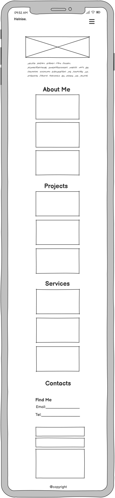
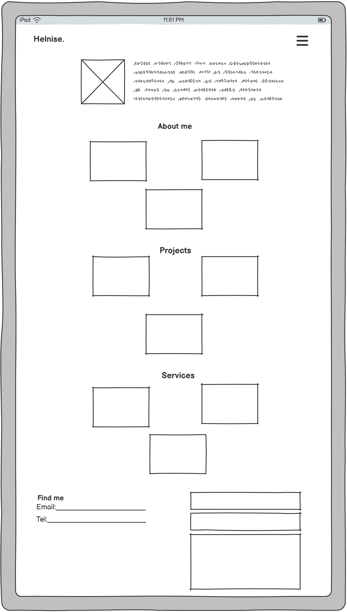
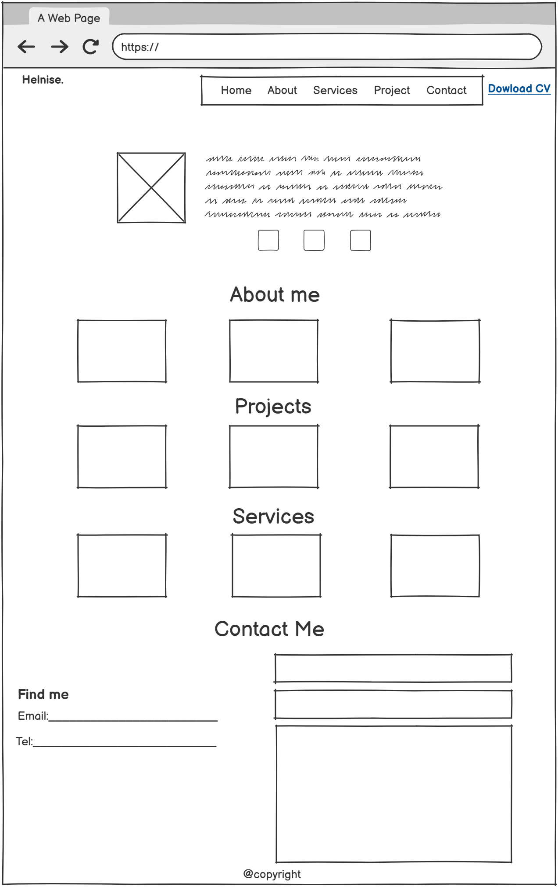

# Helnise Portfolio Website 🌐

Welcome to my personal portfolio website!This site was created to present my journey as a web developer and IT support specialist, showcasing my technical skills, education, and professional interests. It serves as a digital résumé and an online space where recruiters, collaborators, or anyone interested in my work can learn more about me. 
## 🚀 Live Preview

 https://helnises.github.io/my-own-first-project/

---
[Contents](#contents)
  * [User Goals](#user-goals)
  * [User Stories](#user-stories)
  * [Website Goals and Objectives](#website-goals-and-objectives)
  * [Wireframes](#wireframes)
  * [Design Choices](#design-choices)
    + [Typography](#typography)
    + [Colour Scheme](#colour-scheme)
    + [Images](#images)
    + [Responsiveness](#responsiveness)
- [Features](#features)
  * [Existing Features](#existing-features)
- [Technologies Used](#technologies-used)
  * [Languages](#languages)
  * [Libraries & Framework](#libraries---framework)
  * [Tools](#tools)
- [Testing](#testing)
  * [Bugs Fixed](#bugs-fixed)
  * [Responsiveness Tests](#responsiveness-tests)
  * [Code Validation](#code-validation)
    + [HTML](#html)
    + [CSS](#css)
  * [Feature Testing](#feature-testing)
  * [Accessibility Testing](#accessibility-testing)
  * [Lighthouse Testing](#lighthouse-testing)
  * [Browser Testing](#browser-testing)
- [Deployment](#deployment)
  * [To deploy the project](#to-deploy-the-project)
  * [To fork the project](#to-fork-the-project)
  * [To clone the project](#to-clone-the-project)
- [Credits](#credits)

## User Goals

This portfolio website has been carefully crafted with the user in mind. Key user experience considerations include:
* User friendly navigation.
* Non distracting background.
* Learn about me.
* Explore my skills.
* Review my education.
* Connect with me.
* Get a snapshot of my work style.

## User Stories

This portfolio project evolved through several stages of learning and iteration:

* As a visitor, I want to quickly understand who the developer is and what they do,
So that I can decide if I’m interested in exploring their work or contacting them.

* As a hiring manager, I want to view the developer’s education and technical skills in a clear, professional format,
So that I can evaluate their suitability for a job role.

* As another developer, I want to see what tools and technologies they use,
So I can learn from their tech stack or potentially collaborate.

*  As a trainer or mentor, I want to assess the developer’s progress and areas of expertise,
So that I can give relevant feedback or advice.

* As a recruiter with limited time, I want to scan the portfolio and find education, skills, and contact info easily,
So that I can make a quick hiring decision or shortlist the developer.

## Website Goals and Objectives

* Showcase my skills and experience.
* Create a professional online presence. 
* Highlight my education and training.
* Offer simple and accessible ways to get in touch with me.
* Use responsive, mobile-first design to ensure compatibility across all devices.
* Organize content into logical sections for easy finding. 
* Increase overall website traffic by increasing rankings on search engine.

 ## Target Audience

* Hiring Managers and Recruiters
* Fellow Developers
* General Viewers
* Students and Educators

[Back to top](#contents)
## Wireframes

Wireframes were designed using Balsamiq tool. Following best practices, mobile version was designed first, then tablet and lastly the laptop view. There are some deviations from wireframes in the live version of the quiz. It is one page website to enhance the logical flow. I have added level user selected in the question view, a number of correct and wrong answers as well. A functionality of local storage to display top 5 results is included in the final version as well. 

 

 

 

 [Back to top](#contents)

 ## Design Choices

### Typography

| Purpose             | Font Family         | Weight     | Style         |
|---------------------|---------------------|------------|---------------|
| Primary Font        | `Poppins`, sans-serif | 400–700   | Clean, modern |
| Headings (`h1`, `h2`) | `Poppins`, sans-serif | 600–700 | Bold, prominent |
| Body Text (`p`)     | `Poppins`, sans-serif | 400        | Readable, light |
| Navigation / Buttons | `Poppins`, sans-serif | 500–600   | Clear, accessible |

**Fallback Fonts:** `sans-serif`  
**Font Source:** Google Fonts – [Poppins](https://fonts.google.com/specimen/Poppins)

### Colour Scheme

| Element / Section            | Color Description       | Hex Code     |
|-----------------------------|--------------------------|--------------|
| Body Background             | White                    | `#ffffff`    |
| Default Text                | Dark Gray                | `#212121`    |
| Navbar Background           | Black                    | `#000000`    |
| Navbar Link Hover           | Cyan                     | `#00bcd4`    |
| Download Button             | Teal                     | `#00796b`    |
| Download Button (Hover)     | Pink                     | `#c2185b`    |
| Highlighted Name Text       | Red                      | `#d32f2f`    |
| Section Headings            | Deep Rose                | `#880e4f`    |
| Boxes / Cards Background    | Light Gray               | `#f5f5f5`    |
| Box Borders                 | Dark Gray                | `#424242`    |
| Contact Info Text           | Purple                   | `purple`     |
| Testimonials Border Accent  | Light Pink               | `#f48fb1`    |
| Footer Background           | Light Gray               | `#f5f5f5`    |
| Button Text Color           | White                    | `#ffffff`    |
| Shadow Effects              | Light Black Transparent  | `rgba(0,0,0,0.1)` to `0.15` |

# Features

## Existing Features

### Home
The landing page of the website designed to give visitors a warm introduction. It usually includes a professional photo or graphic, a catchy tagline, and a brief overview of who I am and what I do. This section sets the tone and invites visitors to explore further.

## About
This section provides an in-depth look at my background, including my education, skills, work experience, and personal interests. It helps visitors and potential clients get to know me better and understand my qualifications and expertise.

## Services
A detailed listing of the professional services I offer, such as website design, development, SEO consulting, and ongoing site maintenance. Each service is described clearly so clients can see how I can meet their needs and add value to their projects.

## Projects
A portfolio showcase featuring examples of my past work. Each project includes images, descriptions, technologies used, and the challenges I solved. This section demonstrates my practical experience and technical skills to potential employers or clients.

## Testimonials
A collection of authentic client reviews and feedback to build trust and credibility. Each testimonial includes the client’s name, role, and their positive experience working with me, helping to reinforce my professionalism and reliability.

## Contact
A straightforward contact form allowing visitors to send inquiries or messages directly from the website. It also includes additional contact details such as email and social media links to facilitate easy communication.

## Download CV
A prominent button or link that allows visitors to download my up-to-date CV or resume in PDF or Word format. This makes it easy for potential employers or clients to save and review my qualifications offline.

## Footer
A clean and modern foote, that displays copyright.

[Back to top](#contents)

# Technologies Used

## Languages

- [HTML](https://developer.mozilla.org/en-US/docs/Glossary/HTML5 "HTML")
- [CSS](https://developer.mozilla.org/en-US/docs/Web/CSS "CSS")

## Libraries & Framework

- [Google Fonts](https://fonts.google.com/ "Google Fonts")

## Tools

* [GitHub](https://github.com/ "GitHub")
* [GitPod](https://www.gitpod.io/#get-started "GitPod")
* [Balsamiq](https://balsamiq.com/wireframes/ "Balsamiq")
* [W3C HTML Validation Service](https://validator.w3.org/ "W3C HTML")
* [W3C CSS Validation Service](https://jigsaw.w3.org/css-validator/ "W3C CSS")
* [Responsive Design Checker](https://responsivedesignchecker.com/ "Responsive Design Checker")
* [WAVE Accessibility Tool](https://wave.webaim.org/ "WAVE Accessibility Tool")
* [Color Contrast Accessibility Validator](https://color.a11y.com/ "Color Contrast Accessibility Validator")

[Back to top](#contents)

# Testing

## Bugs

During development and testing, several issues were identified and resolved to improve the website's accessibility, HTML structure, and overall performance.

### Testing Tools Used
- **WAVE Accessibility Tool**
- **W3C HTML Validator**
- **Google Lighthouse**

### Summary of Issues

| Issue Type            | Description                                                                 | Tool Used     | Fix Status       |
|-----------------------|-----------------------------------------------------------------------------|---------------|------------------|
| Contrast Errors       | Very low contrast (e.g. 1.1:1) between text and background.                 | WAVE          |  Updated colors |
| Missing `<h1>`        | No top-level heading was detected on the main page.                         | WAVE          |  Added `<h1>`   |
| Unclosed Tags         | Multiple unclosed elements: `<form>`, `<section>`, `
`, and `<body>`.   | W3C Validator |  Fixed structure|
| Stray Closing Tag     | Extra closing `</form>` tag found.                                          | W3C Validator |  Removed        |
| Skipped Heading Level | Heading structure was inconsistent, skipping from `<h1>` to `<h3>`.         | WAVE          |  Reorganized    |
| Suspicious Alt Text   | Some images had missing or unclear `alt` attributes.                        | WAVE          |  Added proper alt|
| Link to Word Document | Linking directly to a downloadable `.docx` file raised accessibility flag. | WAVE          |  Added label    |
| Large Image Size      | Hero image not optimized—recommended savings of 250+ KiB.                   | Lighthouse    | Optimized file |

###  Notes
- All HTML structure errors were corrected to ensure proper nesting and closing of tags.
- Accessibility scores improved significantly after fixing contrast and heading issues.
- A smaller image in WebP format was used to enhance loading performance.

## Code Validation

### HTML

[HTML](assets/images/html.img.JPG)

* Feedback Acknowledgement:

[Back to top](#contents)

### CSS
[CSS](assets/images/css.img.JPG)

[Back to top](#contents)

[Back to top](#contents)

## User Story Testing

| User Story                                                                              

[Back to top](#contents)

## Feature Testing

This website was extensively tested for functionality using both Chrome and Edge developer tools.

Every feature was manually tested using the test script and outcomes recorded. 

[Back to top](#contents)

## Accessibility Testing

I have used web accessibility evaluation tool [WAVE Tool](https://wave.webaim.org/) which helps to determine if web content is accessible to individuals with diverse needs. No issues were raised.

[WAVE](assets/images/wave.img.JPG)

[Back to top](#contents)

## Lighthouse Testing

* Performance - how quickly a website loads and how quickly users can access it.
* Accessibility - test analyses how well people who use assistive technologies can use your website.
* Best Practices - checks whether the page is built on the modern standards of web development.
* SEO - checks if the website is optimised for search engine result rankings.

[Back to top](#contents)

# Deployment

## To deploy the project

- Navigate to the repository on GitHub and click on **Settings**.

- In the side navigation and select **Pages**.

- In the **None** dropdown and choose **Main**.

- Click on the **Save** button.

- The website is now live at 
_Any changes required to the website, they can be made, committed and pushed to GitHub._

[Back to top](#contents)

## To fork the project

Forking the GitHub repository allows you to create a duplicate of a local repository. This is done so that modifications to the copy can be performed without compromising the original repository.

- Log in to GitHub.
- Locate the repository.
- Click to open it.
- The fork button is located on the right side of the repository menu.
- To copy the repository to your GitHub account, click the button.

## To clone the project

- Log in to GitHub.
- Navigate to the main page of the repository and click Code.
- Copy the URL for the repository.
- Open your local IDE.
- Change the current working directory to the location where you want the cloned directory.
- Type git clone, and then paste the URL you copied earlier.
- Press Enter to create your local clone.

[Back to top](#contents)

# Credits

- Feedback, advice and support:

  - [Simen Daehlin](https://github.com/Eventyret "Simen Daehlin")

- Code inspiration and learning content:

  - [W3C Schools](https://www.w3schools.com/ "W3C Schools")
 
* YouTube Channels 
  
  

* Visual content:

  - [Coolors](https://coolors.co/ "Coolors")
  
* Images:
  [Profile]imgenic.com
  [testimonial](https://unsplash.com/)
  

[Back to top](#contents)

PRO## 📄 License

This project is open for learning and sharing purposes. Please credit the original author if reused or modified.
